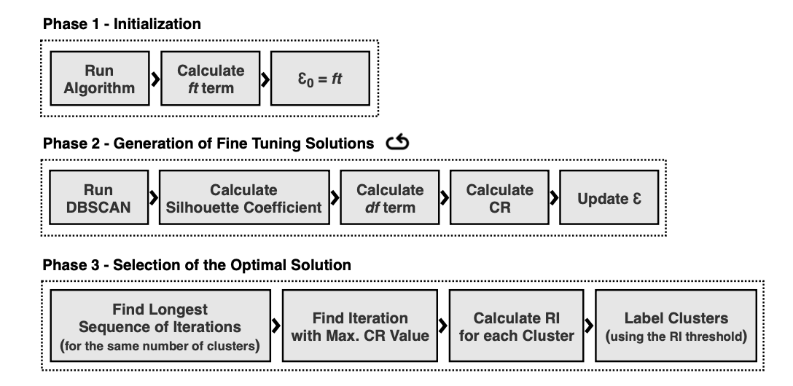
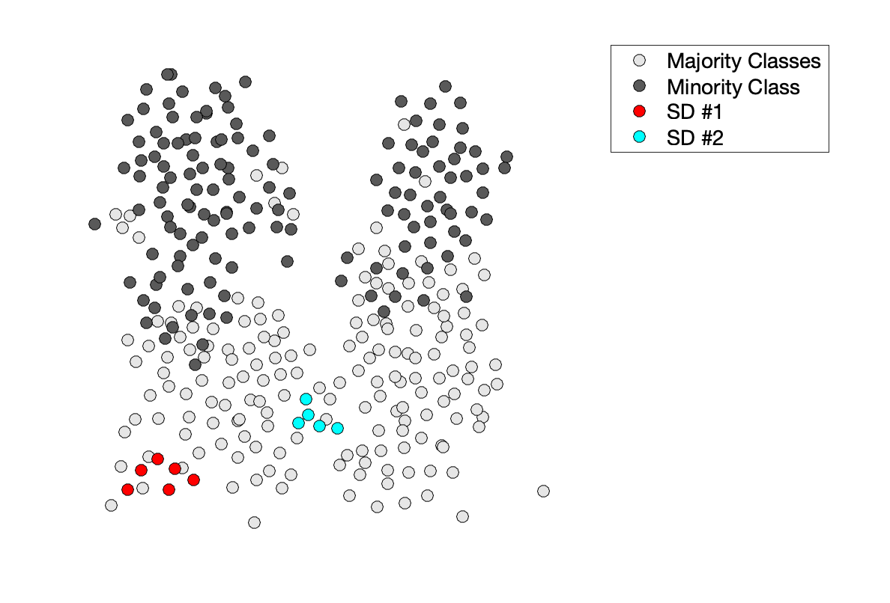

# fine-tuning-dbscan
**This package implements a density-based clustering fine-tuning approach for the identification of small disjuncts:**

- The algorithm was designed to leverage DBSCAN in order to identify sub-concepts in data, corresponding to small disjuncts;
- The implementation considers appropriate evaluation criteria to tune the parameters of the clustering algorithm, searching for the optimal solution that determines existing underrepresented sub-concepts.





## Example of use:

```matlab
addpath('data');
addpath('dbscan');

load example-2-clust
[SDs, X_n, Y_n] = findSD(X,Y,2,1);
```


